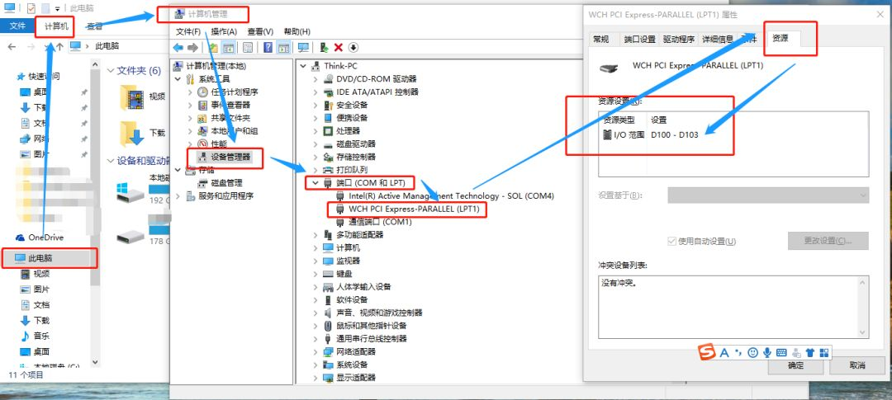

# 传输Marker/Trigger的实现

在心理学和认知神经科学的研究中，经常会使用采集脑电波的设备来记录个体在特定刺激诱发下产生的脑电波，从而反映出个体对特定刺激的认知加工过程。因此在进行脑电实验编程时，需要解决实验中刺激呈现软件和脑电采集设备之间事件或刺激标记（Mark、Event Code、Trigger）的实施同步传输问题，以便在后续进行脑电数据分析时能够依据相应的事件或刺激标记进行叠加平均。因此本章主要讲述在目前常用的心理学刺激呈现软件和脑电设备之间如何实现事件或刺激标记的实时同步传输。

在心理学和认知神经科学中，事件或刺激标记通常分为刺激Mark（必备）、反应Mark（可选）和试次编号Mark（可选)。其中，刺激Mark用于标记不同的刺激事件或实验条件，是脑电数据采集的核心标记，也是后续进行脑电数据分析（如：分段、基线校准、叠加平均等）的基础。在开展实际研究时，研究者一般会设定不同的刺激条件，从而比较不同刺激条件诱发的脑电的差异。因此在进行刺激呈现时需要对不同的刺激条件采用相对应的刺激标记，一般在刺激呈现前（Onset）或呈现后（Offset）向脑电设备传送相应的刺激标记。反应Mark一般用于识别和标记实验过程中个体对刺激进行反应的情况，根据个体的不同反应情况可以分为正确反应Mark、错误反应Mark和无反应Mark，一般在个体进行反应后向脑电设备传送相应的反应标记。若在采集脑电的过程中，实时传送反应Mark，则在后续进行脑电数据离线分析时可以直接根据反应Mark分析个体在不同反应情况下的脑电数据。试次编号Mark一般用于标记实验中试次编号的Mark，在实验过程中进行实时传输试次编号Mark，可以便于研究者在进行脑电数据离线分析时操作和处理每个试次的脑电数据，一般在试次开始呈现（如：注视点）前向脑电设备传送相应的标记。

在进行事件或刺激标记传输时，需要注意以下原则：（1）事件或刺激标记必须是范围0\~255的正整数数字，除正整数数字数字外的其他符号无法传输到脑电设备中。目前的脑电设备接收的事件或刺激标记一般是通过刺激呈现设备的并行接口的通信线进行传输的，鉴于并行接口的接口规范，在实际过程中最多能传输28个不同数字，即256个事件或刺激标记。而在开展实际研究时，建议研究者从1\~254的数字范围中选取相应的数字作为事件或刺激标记。（2）事件或刺激标记切忌重复，尤其是刺激Mark。在实际研究中，不同的刺激Mark和反应Mark不能用同一个数字。若试次编号Mark超过255，则研究者在选取标记数字时需要根据实际情况进行灵活处理。（3）一个事件或刺激标记传输完成后须立即结束标记（也有研究者称之为清零）。如果不执行清零步骤，可能会出现Mark乱码及Mark增多或重复等幽灵Mark的情形。若出现上述情形，可能会影响脑电数据的离线分析。因此，建议研究者在出现上述情形时及时中断实验研究，对刺激呈现设备、脑电采集设备以及设备间的通信进行逐一排查，解决上述问题后在继续开展实验。（4）注意设备间的通信传输延时，避免出现刺激呈现设备传输事件或刺激标记正常，而脑电采集设备却无法接收到事件或刺激标记，导致后续脑电数据无法进行离线分析。

## 1 基于并口接口的Mark传输

在现有的脑电采集设备中大多使用PCI-E （25针）并口通讯协议进行刺激呈现设备与脑电采集设备进行实时的事件或刺激标记通信传输。本节我们将详细介绍如何在一些常见的刺激呈现软件上实现上述过程。

### 1.1  并口接口中通信端口号的查找与获取方法

在使用并口接口传输事件或刺激标记时，需要先在设备上查找相应的并口通信端口号。查找方法为：如图所示，打开"计算机管理"，并展开“设备管理器”，在“端口”中找到相应的并口端口，一般为：\*（LPT#），其中\*为PCI-E （25针）并口的驱动软件名称，#为端口序号。之后单击相应的端口选项，打开端口属性，并选择“资源”选项卡，查看相应的I/O范围，一般为0378-037F，这个数值是会随设备的不同而发生改变（如：示例图片中的I/O范围就为D100-D103），因此在第一次使用时需要实验者按照上述方法进行确定。I/O范围即为相应的并口端口号，一般会选择第一个数值作为传输事件或刺激标记时的端口号。

<figure><figcaption></figcaption></figure>

### 1.2 实例运用

#### 1.2.1 在E-prime刺激呈现软件中的实现

目前在E-prime中实现事件或刺激标记传输的方法主要有“OnsetSingal”方法和“WritePort”方法两种方法，在开展实际研究时，选取其中一种方法即可，一般建议使用“OnsetSingal”方法，也有研究者在实际研究中将两种方法混用。下面我们将逐一进行介绍。

**1.2.1.1 “OnsetSingal”方法**

在使用“OnsetSingal”方法进行事件或刺激标记传输时，必须依赖程序中的一个实体对象进行，在此基础上只需要通过以下语句执行相应的操作功能，即可实现信号的传输。

1.设置事件或刺激标记的输出端口（即并行端口）

语句：对象.OnsetSignalPort = \&H+I/O范围，如：对象.OnsetSignalPort = \&HD100。

其中，对象为E-prime中刺激呈现控件的名称。

2\.     激活信号端口

语句：对象.OnsetSignalEnabled= True。

其中，当OnsetSignalEnabled值为“True”，表示信号端口已激活;而值为“False”时，表示信号端口未被激活。

3.信号端口清零

语句：对象.OnsetSignalData =“0”

4.生成事件或刺激标记

语句：对象.OnsetSignalData = 具体的Mark数值（推荐数值的使用范围为1-254）

这里需要特别注意的是语句中的“具体Mark数值”必须加上英文状态下的双引号""，如：对象.OnsetSignalData = "22"，即把“22”作为事件或刺激标记传输到脑电采集设备上。

**1.2.1.2 “WtitePort”方法**

在使用“WritePort”方法进行事件或刺激标记传输时，不需要依赖程序中的实体对象进行，可以直接将事件或刺激标记传输到脑电数据采集设备上。同时，语句中的“具体Mark数值”不需要加上英文状态下的双引号。语句为：WritePort & H+I/O范围，具体的Mark数值。例如：WritePort & HD100，22。即把“22”作为事件或刺激标记传输到脑电采集设备上。若需要执行清零步骤，则使用清零语句：WritePort & HD100，0。

#### 1.2.2 在基于Python/Matlab开发的刺激呈现软件中的实现

鉴于目前使用的Windows操作系统多为64位，在使用Python/Matlab开发的刺激呈现软件进行I/O端口的事件或刺激标记传输时需要建立专用的接口插件。因此本节主要介绍如何建立接口插件运行环境以及如何在不同开发平台上实现事件或刺激标记的传输。

**1.2.2.1 运行环境准备**

首先需要确保Windows操作系统已经完整安装了Microsoft Visual C++ SP1 运行库或运行环境。随后需要准备运行环境的相关接口插件，插件名称列表为：io64.mexw64，config\_io.m、inp.m、outp.m以及inpoutx64.dll、inpout32.h 、inpoutx64.lib 、inpoutx64.sys 等。准备好上述插件后，按照以下步骤进行安装。

1\.   将io64.mexw64模块复制或移动到MATLAB路径中的目录中（例如，D:\Software\MATLAB\R2013b\toolbox\）。

2\.   将inpoutx64.dll、inpout32.h 、inpoutx64.lib 、inpoutx64.sys 四个模块复制或移动到C：\ windows\system32\ 。为了避免出现出错，建议同步复制到C:\Windows\SysWOW64\，为了确保程序正常运行，四个模块必须位于Windows系统路径（PATH）中。

3\.   将config\_io.m，inp.m和outp.m等文件复制或移动到实验程序所在文件夹。

4\.   在Matlab中使用下述代码进行测试。

如果在命令运行窗口（Command Windows）出现“InpOutx64 driver is open”，就意味着运行环境的相关接口插件已经部署完毕，可以进行后续的事件或刺激标记传输。

&#x20;

**1.2.2.2 在基于Matlab开发的刺激呈现软件中的实现：以Psychtoolbox 3 为例**

在进行事件或刺激标记传输前，需要先对运行环境的接口进行测试，测试代码为：

如果在命令运行窗口（Command Windows）出现“InpOutx64 driver is NOT open”，则须中断实验，按照 “1.2.2.1 运行环境准备”进行故障排除。

若运行环境没有问题，则在需要传输事件或刺激标记的位置使用“outp”函数进行。实现方式如下：

在开始新一轮次事件或刺激标记传输前，先进行清零步骤。示例代码为：

若在实验过程中还需要设置反应Mark，可以使用if语句，参照以下代码进行：

&#x20;

**1.2.2.3 在基于Python开发的刺激呈现软件中的实现：以Psychopy 3 为例**

**1 刺激Mark的传输**

如下图，需要打mark的刺激是SCREEN\_3这个组件，这个组件的内容出现，mark就要出现。

操作方式：

1\.       在SCREEN\_3组件下方添加一个 Parallel Out 并行端口组件（Builder窗口下，右边Component选项卡 –> EEG选项卡 –> Parallel Out），如上图，p\_port\_2是我添加的并行端口组件

2\.       点开p\_port\_2组件的属性选择 —> 基础Basic选项卡中—>Start，即Mark的开始方式。在下拉选项卡中选则条件condition，在后方加入代码：$SCREEN\_3.status==STARTED。表示SCREEN\_3组件一开始，p\_port\_2组件就发送Mark

3\.       在Start的下方Stop，将持续时间duration time改为0.1，即100ms。这个持续时间建议不低于0.016秒，即60Hz刷新率屏幕，一帧的时间。

4\.       然后在数据data选项卡中 —> Start data的框内，输入你条件文件中指代Mark对应的变量名，如下图，我在excel文件中，有一列变量为Mark类型，这一列的名字为condition\_type，把这个列名放在这里即可。Stop data框内保持默认0

如下图，然后切换到硬件hardware选项卡 —> Port address位置选择设备对应的端口号

**2 反应Mark的传输**

反应Mark涉及到根据被试的按键正确和错误判断出现的Mark代码，所以就没法使用 Parallel Out 组件来实现，只有使用 Code 组件来实现，原理和E-prime的方式有些类似。

实现目标：

l  被试按键判断：正确 —> 出现Mark 88

l  被试按键判断：错误 —> 出现Mark 99

l  被试按键判断：无反应 —> 出现Mark 90

操作方式：

1.如下图，我设置按键组件是key\_resp，所以在后面添加了一个code组件code\_7

2\.   如下图，在code\_7组件的 Begin Experiment选项卡 中输入代码：

l  ⚠️该代码的p\_port是我随意设置的一个端口名字，但是这个名字可能会和刺激Mark中的Parallel Out组件的名字有冲突，所以建议改为p\_port\_99，这样就避免和其他默认的端口组件名字产生冲突。

l  ⚠️address='0x3FF8'这里的端口号要记得改为和设备一致的端口号（端口号的获取方式见 。。。。。。）

如下图，在code\_7组件的 End Routine 选项卡 中输入如下代码：

l  ⚠️代码中，key\_resp是键盘组件的名称，需要和你自己的名称改为一致的

l  ⚠️p\_port是 Begin Experiment选项卡 中设置的名称，这两个地方要一致，名称随意改。

**3. 消除信道中的反应Mark信息**

实现目标：

在反应Mark出现后，消除反应Mark的通道占用。

操作方式：

1\.       在刺激呈现和反应的Routine后面，新增一个Routine，然后在新增的这个Routine放入一个Code组件，如下图中的code\_5组件，图中的图片组件是我实验设计所需，不是必须的。

如下图，打开Code组件的属性设置 —> 切换到 Begin Routine选项卡 —> 在里面填入如下代码

这个表示获取当前的时间

如下图，切换到 Each Frame选项卡 —> 在里面填入如下代码

这个代码表示，如果当前时间达到0.1秒，就执行p\_port.setData(0)，即把p\_port端口归零，设置停止数据。这里的p\_port就是设置反应Mark的代码中设置的p\_port，两个地方的名称要统一。代码中的0.1可以改为0.016及以上的时间，单位为秒。

目前这种打Mark的方式，经过两次实验的测试，发现有较小几率会出现第一个Mark丢失的情况。直到现在还没有找到问题的根源。解决方法就是在实验开始的指导语的Routine中，给指导语的图片加一个parallel out组件，设置方式和刺激mark的设置方式一样，只是在数据Data选项卡中，Start data使用默认设置，即1，不放入我们的条件Mark进去，让这第一个Mark先出来。即使是这样，也不能完全保证第一个Mark丢失。很奇怪，经过反复测试，只丢第一个Mark，其他试次的Mark都不会丢。这个问题如果找到解决方法了，会在此更新。

## 2 基于串口接口的Mark传输

随着技术的发展和设备的升级更迭，一些电脑设备已经不在提供PCI-E （25针）并口通讯协议，导致刺激呈现设备无法通过并口通讯协议与脑电采集设备进行实时的事件或刺激标记通信传输。为了解决这一问题，科研工作者研发了Parallel Box 并口转换盒，其原理是通过 Parallel Box 并口转换盒通过 USB 接口发送 8 位 TTL 信号，模拟并口 8 位数据通道进行通信。设备输入端为标准 USB 接口（接 PC），设备输出端为 DB25 接口和 BNC 接口（接目标实验设备）；可接入具备标准 DB25 接口或 BNC 接口的脑电设备、近红外脑成像设备、生理仪设备、电刺激设备等，信号传输与转换延迟小于 1 毫秒，输出端口间延迟小于 10 纳秒。；同时支持MATLAB、E-Prime、Vizard、Unity3D 等多种科研实验软件平台。本节我们主要介绍Parallel Box 并口转换盒如何实现事件或刺激标记在刺激呈现软件和脑电采集设备间的实时传输。

(图源：T3VR)

### 2.1 运行环境准备

在首次使用Parallel Box 并口转换盒需要根据实验刺激呈现设备的操作系统选择并安装相对应的驱动程序，目前驱动程序支持在Windows 7、Windows 8-10的32位或64位操作系统上运行。驱动程序的下载方式为：[https://www.t3vr.com/productinfo/1062085.html](https://www.t3vr.com/productinfo/1062085.html) 。百度网盘下载链接：https://pan.baidu.com/s/13fYRiySEFhFKSJBSB3W0\_Q，提取码：3ft8。

安装完毕后需要在设备上查找相应的串口通信端口号，查找方法为：如图所示，打开"计算机管理"，并展开“设备管理器”，在“端口”中找到ParallelBox TTL 转换盒的端口号，一般为STMicroelectronics Virtual COM Port(COM\*），\*在实际研究中为具体的数字。在示例图片中ParallelBox TTL 转换盒的端口号为 COM3，在后续的实验控制和事件或刺激标记传输过程中我们使用的端口号即为COM3。

&#x20;

在上述步骤完成之后，用USB线将 ParleBox TL 转换盒的 USB 一端接入实验刺激呈现设备，将脑电采集设备中用到的事件或刺激标记传输线的另一端接入到 ParleBox TL 转换盒的 DB25 接口或 BNC 接口上。如果研究者无法确定Parallel Box 并口转换盒的驱动程序安装以及设备的连接是否正常，可以使用专门为Parallel Box 并口转换盒配套的测试软件  PBTester进行测试，其主要作用是方便使用者快速判断Parallel Box 并口转换盒是否安装成功并正常使用。

### 2.2 实例运用

#### 2.2.1 在E-prime刺激呈现软件中的实现

首先需要打开“Experiment Object”，在“Devices”选项卡中单击“Add...”添加Serial控件，添加完毕之后，单击打开“Serial”。并填入相应的参数（1）COM  Port，为设备在实验主机中的端口号（2.1 运行环境准备）。在本次示例中，端口号为3。（2）Bits  per  second：115200；（3）Data  Bit：8；（4） Parity： None； （5）StopBits：1 。参数填写完毕后，点击“OK”进行保存。

&#x20;

完成上述操作流程之后，根据实验需要通过代码命令“Serial.WriteInteger”或“Serial.WriteByte”控制事件或刺激标记的传输。语句为：Serial.WriteIntegr 具体数值（如：Serial.WriteIntegr 255）或 Serial.WriteByte 具体数值（如：Serial.WriteByte 255），以上两种方法不依赖与程序中的实体控件或对象，同时可能因版本不同而存在差异，研究者在使用时需根据当前使用版本进行测试后使用。示例语句为：

若需执行清零步骤，则将具体数值设置为0即可。示例语句为

&#x20;

#### 2.2.2 在基于Matlab开发的刺激呈现软件中的实现

在Matlab中首先需要打开串口端口，其中端口为设备在实验主机中的端口号（2.1 运行环境准备），端口打开的代码为：

### &#x20;

之后在需要进行事件或刺激标记传输的位置使用“fwrite”方法进行传送。示例代码为：

&#x20;

在开始新一轮次事件或刺激标记传输前，先进行清零步骤。示例代码为：

&#x20;

在整个实验结束后，需要执行以下代码关闭端口。

### &#x20;

### 2.3 注意事项

在使用Parallel Box 并口转换盒进行实验时，需要注意以下几点：（1）由于刺激呈现设备和脑电采集设备之间可能存在一定的通信延时，建议进行事件或刺激标记传输后，不要立即执行“清零”操作，要为脑电采集设备提供充足的采样时间，从而确保脑电采集设备接收到相应的事件或刺激标记数值。（2）在进行事件或刺激标记传输前，建议对脑电采集设备的传输触发条件（如：高电平降到低电平时，或者低电平升到高电平时）进行测试，并根据测试后的结果设置相应的触发条件进行事件或刺激标记传输。（3）在使用过程中要确保在实验结束时通过对应的“close”命令关闭相应的端口，否则可能会导致在执行新的实验程序时因设备端口仍被上一次实验连接占用而无法运行新的实验程序，尤其是在MATLAB中需要格外注意。（4）为了确保数据采集的稳定性，请不要将目标采集器与其它用电设备在同一电源上接入。同时，目标采集器和Parallel Box 并口转换盒周边应避免出现强磁强电流设备（如：充电中的移动充电宝等）。（5）若设备因不明原因断开连接，可能是因为刺激呈现设备的USB供电不稳定，建议换到其它USB接口进行使用。如果刺激呈现设备是笔记本电脑，则建议笔记本电脑接上外接电源。

&#x20;

参考文献（待补充.......）：
